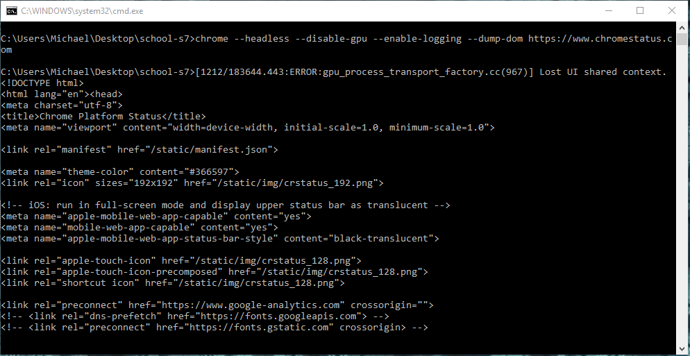
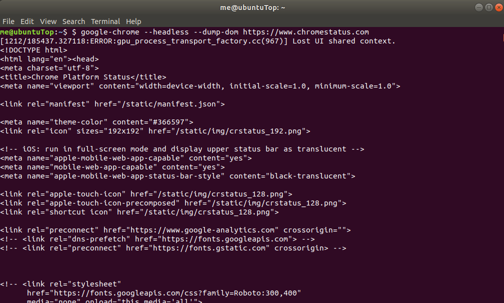
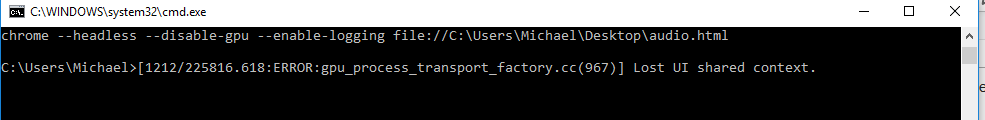
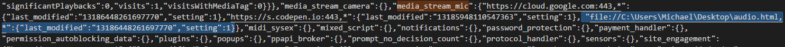

## Start with a GUI browser, then go make things needlessly complicated with servers in Docker containers later:

### Capturing Microphone Audio via a browser:

Let's start by checking out how to capture audio on a standard html webpage. We can see if we can get this to be served by the Docker container later. 

I found this google web fundamentals article by Paul Kinlan: [Recoding Audio form the User](https://developers.google.com/web/fundamentals/media/recording-audio/) to be fairly informative--particularly the "Acquire access to the microphone" section onward. Note that the second example, which tries to stream microphone input to an on-page audio player, seems to throw an error when you try to run createObjectURL() on the raw microphone stream. This is [allegedly](https://stackoverflow.com/questions/27120757/failed-to-execute-createobjecturl-on-url) because createObjectURL() prefers Blob, File, or MediaSource types.

There are several components to capturing and handling microphone audio that are featured in the tutorial:

```javascript
navigator.mediaDevices.getUserMedia({ audio: true, video: false })
                  .then(handleSuccess);
```

This snippet will capture input from the microphone, then return  a raw data stream to a callback function (in this case, one named "handleSuccess")

The author then talks about handling the raw microphone audio by attaching it to a [ScriptProcessorNode](https://developer.mozilla.org/en-US/docs/Web/API/ScriptProcessorNode), which is a type of [AudioNode](https://developer.mozilla.org/en-US/docs/Web/API/AudioNode), which is part of the [AudioContext](https://developer.mozilla.org/en-US/docs/Web/API/AudioContext). Basically an AudioContext is a collection of objects that work together to direct and process audio streams. Generally, an AudioNode may be able to read inputs, and do some audio processing, and generate some outputs. In this case, we use a [MediaStreamAudioSourceNode](https://developer.mozilla.org/en-US/docs/Web/API/MediaStreamAudioSourceNode) type of AudioNode, which can be constructed with raw audio streaming from the microphone, and then direct that stream into a node that processes the audio (ScriptProcessor), which has a .onaudioprocess listener that allows us to do things with the microphone audio when it is received via the Audio context's various nodes. In the snippet below, the flow of microphone audio is from the user's microphone mediaDevice to MediaStreamSource to ScriptProcessor, to a callback function called by the ScriptProcessor's .onaudioprocessor listener (fired when ScriptProcessor detects audio streaming through it). 

Now that you're thoroughly confused, here's some code for a webpage that activates the user's microphone, and then throws it into handleSuccess() which creates an AudioContext() to take, process, and redirect the raw microphone audio to  your computer's speakers (since the default destination for an AudioContext appears to be the computer's speakers).

The following code snippet is a mashup between code found in [Paul Kinlan's article](https://developers.google.com/web/fundamentals/media/recording-audio/), and the [MDN documentation for AudioProcessingEvent](https://developer.mozilla.org/en-US/docs/Web/API/AudioProcessingEvent) :

```html
<!DOCTYPE html>
<html>
    <body>
        <p>stream will (probably) start as soon as you allow access to your microphone</p>
            <button id="playButton" onClick="playButtonFunc()">resume streaming mic to speakers</button>
            <button id="stopButton" onClick="stopButtonFunc()">stop!!!</button>
            <script>
             //globals to hold the AudioContext, which will handle other audio processing objects
              var context;
                var processor;
                //logic to send mic audio to a server might be
                //included in this 	callback as an improvement
                // (ie a server running a docker container)
              var handleSuccess = function(stream) {
                    context = new AudioContext();
                     var source = context.createMediaStreamSource(stream);
                     //Defines the buffer size of the audio, and # of
                  	//input and output channels
                     //Fires the .onaudioprocess event as soon as the
                  	//audio buffer is filled.
                      processor = context.createScriptProcessor(1024, 1, 1);

                     source.connect(processor);
                     //AudioContext.destination defaults to your computer's
                  //speakers unless otherwise specified?
        //see: https://developer.mozilla.org/en-US/docs/Web/API/AudioDestinationNode
                     processor.connect(context.destination);

                     processor.onaudioprocess = function(audioEvent) {
                     // Do something with the data ( see examples at
                     // https://developer.mozilla.org/en-US/docs/Web/API/AudioProcessingEvent)
                     var inputBuffer = audioEvent.inputBuffer;
                     var outputBuffer = audioEvent.outputBuffer;
                     //assume microphone audio is mono (only one channel):
                     var inputData = inputBuffer.getChannelData(0);
                     var outputData = outputBuffer.getChannelData(0);
                     

                     //for now, loop through all samples in the input buffer,
                     //and pass them straight to output:
                     for (var sample = 0; sample < inputBuffer.length; sample++){
                         outputData[sample] = inputData[sample];
                     }
                    };
                 };        
              navigator.mediaDevices.getUserMedia({ audio: true, video: false })
                  .then(handleSuccess);
				//resume listening to audio streaming from the mic
                 playButtonFunc = function(){
                    context.resume();
                 }
                //keeps mic activated, but pauses listening to it
                 stopButtonFunc = function(){
                     context.suspend();
                 }
            </script>
    </body>
</html>
```

** It should be noted that the AudioProcessingEvent (argument 'e' in the onaudioprocess listener callback function), and the ScriptProcessorNode that spawns it in the WebAudioAPI may soon be replaced by the [AudioWorklet interface](https://webaudio.github.io/web-audio-api/#audioworklet). However, MDN claims that AudioProcessingEvent is deprecated, while its AudioWorklet replacement is experimental... so lets stick with  the old, stable ScriptProcessorNode for now...


Neat. We have a webpage that we can supposedly run with a Chrome headless browser (however, it is likely that the headless browser will have to be configured to have permission to access the microphone)

## running chrome headless:

### Windows

1. add google chrome to your [path](https://www.java.com/en/download/help/path.xml)

2. you can try to follow the tutorial on [getting started with headless chrome](https://developers.google.com/web/updates/2017/04/headless-chrome), however, the listed commands to --dump-dom, --screenshot, or --print-to-pdf will not work unless  you add the --enable-logging flag (which that tutorial says nothing about)
   This command should produce some output (note the --disable-gpu is needed on Windows):

   > chrome --headless --disable-gpu --enable-logging --dump-dom https://www.chromestatus.com


You should get a bunch of raw html output from this command:




### Linux/Not Windows:

1. make sure Chrome is installed (look this up for your distro's package manager)

2. add chrome to your path (for Ubuntu, you append to $PATH in [your ~/.profile](https://askubuntu.com/questions/60218/how-to-add-a-directory-to-the-path))

   > PATH="\$PATH:path/to/chrome/directory"

3. the alias for chrome may change depending on the repository/.tar file/package manager you used to install it.

   > \#may or may not be what chrome is called on your system:
   > google-chrome --headless --dump-dom https://www.chromestatus.com





Ok. It appears we were able to do a thing. What happens if we try to do a thing with our test page that captures microphone audio (see the big snippet for the html page in the section "Capturing Microphone Audio from the browser")?


#### On Windows:

let's try to open our html file for capturing mic audio in chrome headless:

> chrome --headless --disable-gpu --enable-logging  file://C:\Path\to\html\file.html

...and, as expected, nothing seems to happen (especially since we didn't use the --dump-dom flag since we want to run the page)



The page (probably) loaded, but it's not listening to the microphone.

This is probably because we have to [find the default profile loaded with Chrome Headless](http://www.forensicswiki.org/wiki/Google_Chrome#Configuration), copy it, [change the copy to allow automatic permission to microphone input](https://stackoverflow.com/questions/38832776/how-do-i-allow-chrome-to-use-my-microphone-programatically), and change the profile that chrome headless uses (if possible).



Currently, attempts to manually edit Chrome's 'Preference' file lead to Chrome rejecting the changes and reverting the Preference file on launch.
There is probably a way to add the ability to give a file default access. It could be that I was copying the last accessed date, and other JSON values for existing entries to fill in my new object for accessing my microphone testing html file, and this was invalid because Chrome had no history of this new file being accessed.
