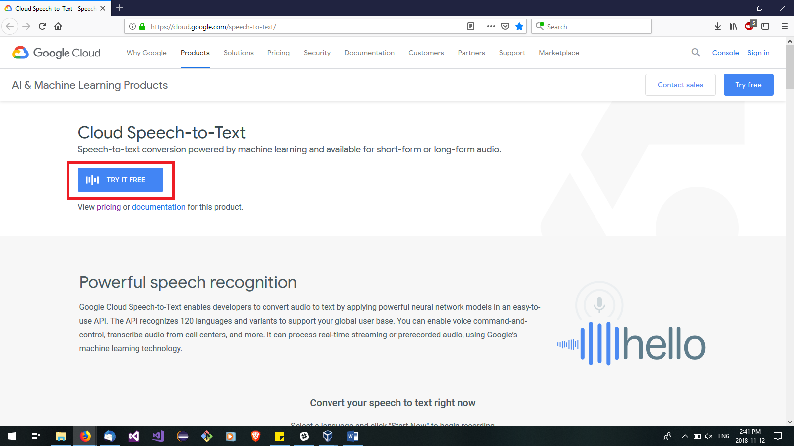
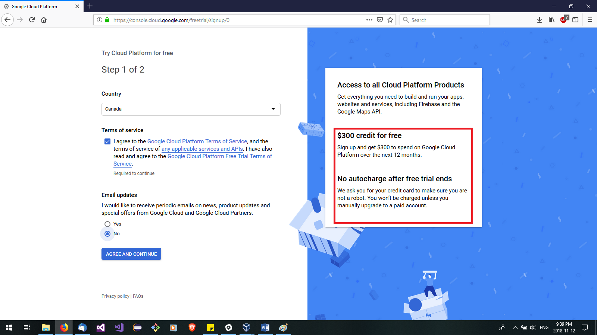

## Purpose of this document:
To document the setup process of trying to use Google's Cloud speech to text API, and some of the pros/cons of trying to use it.

## Summary:
### Pros:

* reasonably accurate speech recognition that can also be improved creating [phrase hints](https://cloud.google.com/speech-to-text/docs/basics#phrase-hints) 
* allows for the interpretation of both streaming of mic input to the cloud app, or upload of a .raw file from mic input.

### Cons:
* Although using google's speech to text is free, it is only free if you keep usage under a specific limit. 
* Requires users to provide a credit card number when creating an account to use the speech to text api and google's cloud services. This is not particularly inviting for an open source project since you're asking potential contributors to go and give their credit card info to google.
* New repo contributors would be asked to create their own API accounts to help stretch the amount that we would all be able to use the speech to text API for free
* Trial periods and api usage limits expire after a year. 
* Streaming audio must be limited to 1 minute snippets at most (would require us to set up event listeners for mic input, and start streaming when person says something)

## Getting The Google Cloud API Set Up:

The following is a rough description on how to get set up with the google cloud speech-to-text api:

Go to  https://cloud.google.com/speech-to-text/, and click the “try it free link”, and follow the listed steps.

 At the time of writing (Nov. 12, 2018), google offers a free 1 year trial of their clould services, which comes with a $300 credit. Unfortunately, setting up an account may (will probably) involve providing google  your credit card information. At the time of writing, usage of google's cloud speech to text API is free as long as you stay under a certain limit (google claims that billing information is for account tracking purposes, and will not move you to a billed plan unless you opt in after your trial expires). I would recommend you check their policies as you’re signing up for the accounts to make sure none of this has changed.

 If you would prefer not to go this route, try to investigate other alternatives, which may be listed in this repo's Research folder.

 

After being taken through the process, you will find yourself at the google cloud platform dashboard. If a project hasn't been created as a result of signing up for the google cloud service. If not,  you can create a project by clicking on a dropdown next to the "google cloud platform" text at the top of the cloud dashboard page.  You can then click the “API & Services” link, then search for “Cloud Speech API”, and after you’ve selected that API and have been redirected to its page, click “Enable”. After attaching billing information to the account, you will be taken to another dashboard—this time for the Cloud Speech API. You will have to create credentials for the api by clicking the button in the upper right corner.

 Set the API restrictions for the API key to be restricted to the Cloud Speech API only.
You can then use the quick start guide at https://cloud.google.com/speech-to-text/docs/quickstart-client-libraries. Following this tutorial, you should have generated a JSON file that holds the credentials for your app, and set command line environment variable named GOOGLE_APPLICATION_CREDENTIALS that points to this json file. If you don’t want to keep setting the environment variable temporarily, you will need to look up how to set it permanently.
https://cloud.google.com/sdk/gcloud/ for setup documentation.

install the google cloud speech recognition api:
npm install --save @google-cloud/speech

## Potential Issues:

### Keeping google from associating an account with your test code:
note see at: https://cloud.google.com/speech-to-text/docs/quickstart-client-libraries#client-libraries-install-nodejs
“Clean up
To avoid incurring charges to your Google Cloud Platform account for the resources used in this quickstart:
•	Use the GCP Console to delete your project if you do not need it.
“

## Working with streaming audio:

documentation: https://cloud.google.com/speech-to-text/docs/streaming-recognize

Potential issue with audio limits when streaming: https://cloud.google.com/speech-to-text/quotas

## Setting up Phrase Hints to help the google api recognize phrases:
https://cloud.google.com/speech-to-text/docs/basics#phrase-hints

